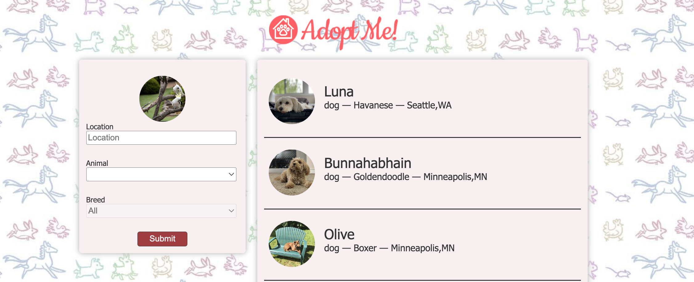

# Welcome to our "Adopt Me" Web Application 🐾💕
  This project is a result of our dedicated work during the FrontendMaster React course, where I learned and implemented the fundamentals of React to create a seamless and engaging user experience. 
  
  My application aims to simplify the pet adoption process, making it easier for users to find their perfect furry companions

  Through a user-friendly interface and intuitive design, we strive to connect prospective pet owners with their ideal pets effortlessly. Join us in our journey to promote responsible pet adoption and create happier homes for our beloved animals!🐶🐱🐇🦜🦎
